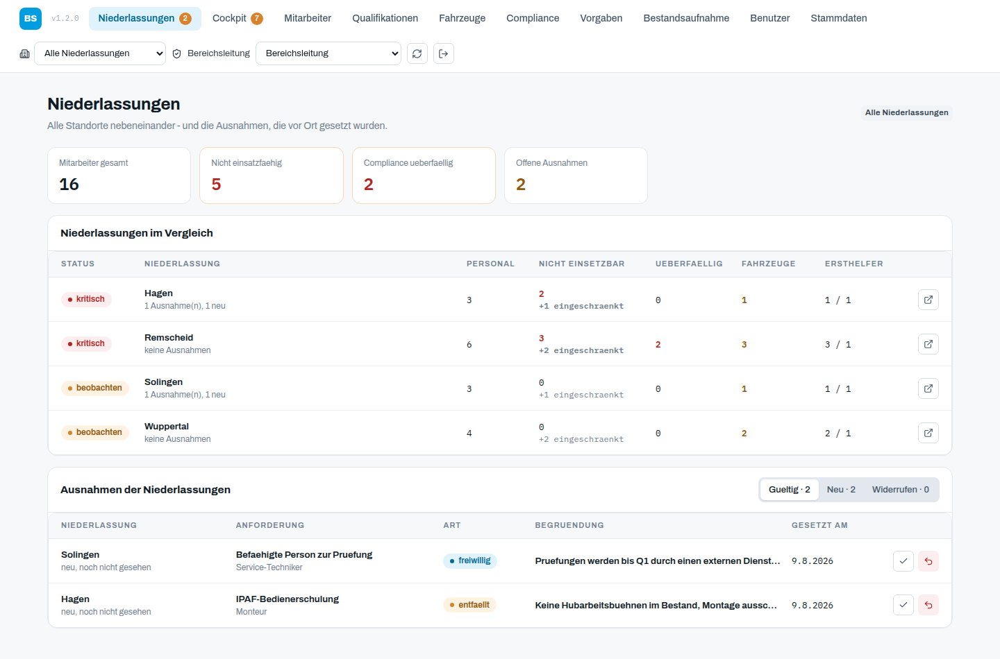
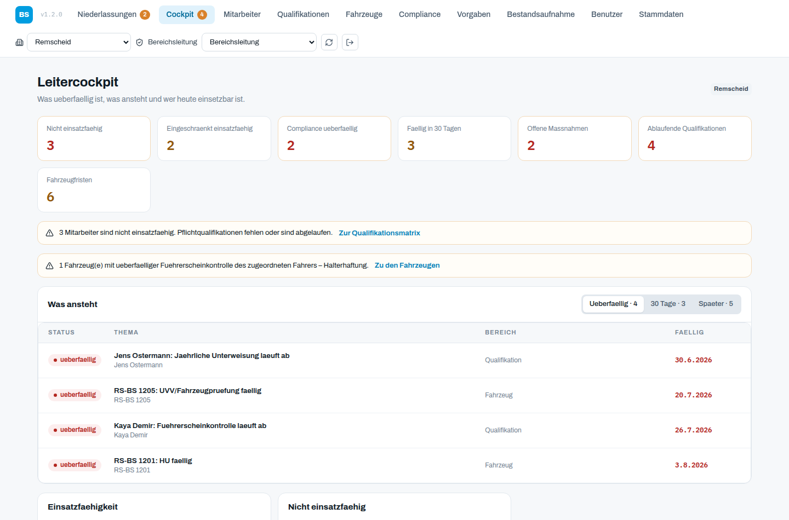

# Remscheid Ops Platform

[](https://github.com/markusjung60389/niederlassung-ops/actions/workflows/ci.yml)

Separate Ops-, Compliance- und Bestandsaufnahme-Anwendung fuer die
Niederlassungen von B.Schmitt mobile - ausgehend von Remscheid, inzwischen
fuer mehrere Standorte nebeneinander.

## Umfang

- **Benutzerverwaltung und Berechtigungen**: Konten, Rollen und
  Niederlassungszuordnung in der Oberflaeche; Anmeldung ueber Microsoft Entra ID
  mit einer Passwort-Anmeldung als Notfallweg. Details in
  [`docs/benutzerverwaltung.md`](docs/benutzerverwaltung.md)
- **Mehrere Niederlassungen**: Umschalter in der Kopfzeile, Portfolio ueber
  alle Standorte, Regeln wahlweise gruppenweit oder oertlich - in beide
  Richtungen umstellbar. Details in
  [`docs/niederlassungen.md`](docs/niederlassungen.md)
- **Cockpit als Arbeitsliste**: was ueberfaellig ist, was in 30 Tagen ansteht,
  wer heute nicht einsetzbar ist, Ersthelferquote nach DGUV Vorschrift 1
- **Funktionen und Qualifikationen**: Projektleiter, Service-Techniker und
  Monteur tragen die Qualifikationen, die sie erfordern; daraus folgt je
  Mitarbeiter die Einsatzfaehigkeit. Details in
  [`docs/qualifikationen.md`](docs/qualifikationen.md)
- **Qualifikationsmatrix**: Mitarbeiter gegen Qualifikationsarten, gefiltert
  auf Luecken
- **Fuhrpark** mit HU, UVV, Service, Fahrerzuordnung und einer Warnung, wenn
  die Fuehrerscheinkontrolle des zugeordneten Fahrers ueberfaellig ist;
  Fahrzeuge lassen sich leihweise oder dauerhaft in eine andere Niederlassung
  verlegen
- **Compliance-Vorgaben und -Eintraege**: die Pflicht getrennt von der Arbeit
  daran, mit Vorlagenkatalog der Standardpflichten, Nachweisen und Massnahmen
- **Ausnahmeregister**: was eine Niederlassung fuer sich ausgesetzt hat, mit
  Begruendung, sichtbar fuer die Bereichsleitung und widerrufbar
- Bestandsaufnahme als Stichtagsaufnahme der Niederlassung
- Incident-Erfassung
- Rollenbasierte Zugriffskontrolle auf allen API-Endpunkten
- Audit Log fuer Compliance-relevante Aenderungen, lesbar ueber `GET /api/audit-log`
- Serverseitig gekapselter Hermes-Client mit Agent-Run-Logging
- Versionierte Alembic-Migrationen
- Docker Compose mit `ops-frontend`, `ops-backend`, `db` und `worker`

Nicht enthalten: Dashboard-Import, Shared DB, Synchronisation mit dem vorhandenen Projekt-Dashboard.

## Oberflaeche





Weitere Ansichten in [`docs/screenshots/`](docs/screenshots/): Mitarbeiter,
Qualifikationsmatrix, Fahrzeuge samt Verlegen-Dialog, Compliance, Vorgaben mit
Geltungswechsel, Benutzerverwaltung mit Rolleneditor, Anmeldebildschirm und
Stammdaten. Die Standorte ausser Remscheid sind Platzhalter fuer die
Abbildungen.

Das Erscheinungsbild folgt dem gemeinsamen PDS-Fokus-Styleguide
([`docs/design/`](docs/design/)), damit die Anwendung mit den uebrigen
Unternehmens-Apps zusammenpasst. Tokens und Bausteine liegen unveraendert in
`frontend/src/styles/`; eigene Farben oder Radien kommen nicht vor.

## Tests

```bash
cd backend && python -m pytest -q          # 214 Faelle
cd frontend && npm run typecheck           # Oberflaeche und API-Typen
cd frontend && npm run e2e                 # 77 E2E-Faelle im Browser
```

Die End-to-end-Tests fahren das gebaute Frontend gegen ein echtes Backend mit
frischer Datenbank. Aufbau und Erweiterung: [`docs/tests.md`](docs/tests.md).

## Authentifizierung

Drei Wege hinein, zwei davon ueber `AUTH_MODE` gesteuert:

| Weg | Verhalten |
| --- | --- |
| `azure_ad` | Microsoft Entra ID. MSAL im Frontend, Token-Pruefung im Backend (Signatur, Issuer, Audience, Ablauf), Abbildung auf lokale Rollen. Der Regelweg. |
| Passwort | Unabhaengig vom Modus verfuegbar: `POST /api/auth/login` gibt ein Sitzungstoken aus. Der Notfallweg fuer den Tag, an dem die App-Registrierung kaputt oder der Tenant nicht erreichbar ist. Abschaltbar mit `AUTH_PASSWORD_LOGIN_ENABLED=false`. |
| `dev` (Standard lokal) | Der Aufrufer weist sich mit `X-User-Id` aus. Nur fuer lokale Arbeit und Tests; das Backend verweigert den Start, wenn gleichzeitig `APP_ENV=production` gesetzt ist. |

**Entra ID ist implementiert und getestet und wartet nur noch auf die
App-Registrierungen** - siehe [`docs/azure-ad-setup.md`](docs/azure-ad-setup.md).

### Notfallzugang

Beim ersten Start entsteht genau ein Konto mit Passwort, wenn keines existiert:

| Feld | Wert |
| --- | --- |
| Anmeldung | `ADMIN_EMAIL`, Vorgabe `admin@ops.local` |
| Startpasswort | `ADMIN_INITIAL_PASSWORD`, Vorgabe `BSchmitt-Ops-2026!` |

Das Startpasswort **muss bei der ersten Anmeldung geaendert werden**; bis dahin
beantwortet die API nichts anderes. Fuenf Fehlversuche sperren das Konto fuer 15
Minuten, jede Anmeldung steht im Protokoll. In Produktion verweigert das Backend
den Start ohne `AUTH_SESSION_SECRET`, solange dieser Weg aktiv ist.

Rollen und Berechtigungen stehen in `backend/app/permissions.py`:

| Rolle | Berechtigungen |
| --- | --- |
| Administrator | `*` - Verwaltung des Werkzeugs und Notfallzugang |
| Bereichsleiter | `*` |
| Niederlassungsleiter | alle Bereichsrechte, aber **kein** `rule:write` und `branch:write` |
| HSE / Compliance | `compliance:*`, `incident:*`, `personnel:read`, `fleet:read`, `assessment:read`, `sales:read`, `rule:read`, `branch:read`, `agent:run`, `audit:read` |
| Betrachter | alle `:read` ausser `user:read` |
| eigene Rollen | frei zusammenstellbar in der Benutzerverwaltung |

Die Rolle entscheidet, **was** jemand darf; das Konto entscheidet ueber
`user_branches` bzw. `users.all_branches`, **wo**. Der Niederlassungsleiter
haelt jedes fachliche Recht, aber gruppenweite Regeln aendert er nicht - sie
reichen in Niederlassungen, fuer die er nicht verantwortlich ist. Fuer die
eigene Niederlassung setzt er stattdessen eine begruendete Ausnahme, die die
Bereichsleitung sieht und widerrufen kann.

Alle `/api/*`-Endpunkte erfordern eine Identitaet, Lesezugriffe eingeschlossen.
Ausgenommen ist nur `/health` fuer den Container-Healthcheck.
Personenbezogene Daten werden zusaetzlich gefiltert: wer `personnel:read` nicht
hat, bekaeme im Cockpit weder Namen noch Aufenthalts- oder Vorsorgetermine.

## Start per Docker

```powershell
Copy-Item .env.example .env
# POSTGRES_PASSWORD und DATABASE_URL setzen - beide haben bewusst keinen Default
docker compose up --build
```

Danach:

- Frontend: http://localhost:3000
- Backend Health: http://localhost:8000/health
- API Docs: http://localhost:8000/docs

Im Entwicklungsmodus waehlt das Frontend oben rechts die Identitaet aus
`GET /api/auth/dev-users`; damit laesst sich das Rollenmodell durchspielen.

Die Datenbank veroeffentlicht keinen Host-Port. Zugriff bei Bedarf ueber
`docker compose exec db psql -U remscheid_ops remscheid_ops`.

## Datenbankschema

Das Schema wird beim Backend-Start ueber `alembic upgrade head` angelegt und
aktualisiert. **Bestandsdaten bleiben dabei immer erhalten** - auch eine
Datenbank aus der Zeit vor Einfuehrung der Migrationen wird uebernommen und
hochmigriert, nicht neu aufgesetzt.

Geseedet werden nur Remscheid, die fuenf Rollen, je ein Konto dazu und der
Notfall-Administrator;
fachliche Daten werden in der App erfasst. Weitere Niederlassungen legt die
Bereichsleitung selbst an - ihre Namen gehoeren der Organisation und nicht
einer Seed-Datei.

Neue Migration nach einer Modelaenderung:

```powershell
cd backend
alembic revision --autogenerate -m "beschreibung"
# erzeugte Datei pruefen, siehe docs/migrations.md
alembic upgrade head
```

Die verbindlichen Regeln dazu stehen in [`docs/migrations.md`](docs/migrations.md).
`alembic check` laeuft in der CI und blockiert eine Modelaenderung ohne Migration.

## Lokale Backend-Pruefung

```powershell
cd backend
python -m venv .venv
.\.venv\Scripts\Activate.ps1
pip install -r requirements.txt
pytest
uvicorn app.main:app --reload
```

Ohne `DATABASE_URL` nutzt das Backend lokal SQLite (`backend/remscheid_ops.db`). Im Compose-Stack wird PostgreSQL verwendet.

Beispielaufruf im Entwicklungsmodus:

```http
GET http://localhost:8000/api/cockpit
X-User-Id: user-branch-manager
```

## Lokale Frontend-Entwicklung

```powershell
cd frontend
npm ci
npm run dev
```

Bei lokaler Entwicklung erwartet das Frontend standardmaessig `http://localhost:8000` als API.
`CORS_ALLOW_ORIGINS` im Backend muss den Origin des Frontends enthalten.

## Hermes-Konfiguration

Secrets bleiben im Backend/Server-Environment:

```env
HERMES_API_BASE_URL=http://host.docker.internal:8642/v1
HERMES_API_KEY=<secret>
HERMES_AGENT_MODEL=hermes-agent
```

Use Cases:

```http
GET  /api/hermes/context/branches/branch-remscheid   # compliance:read + personnel:read
POST /api/agent/compliance-review                    # agent:run
```

Der Kontext-Endpunkt liefert Hermes die erfassten Bestandsaufnahme-, Compliance-,
Mitarbeiter- und Massnahmendaten. Der Review-Endpunkt speichert Request und
Response in `agent_runs`.

## Betrieb aus veroeffentlichten Images

Images liegen auf ghcr.io; die Konfiguration wird beim Containerstart injiziert,
dasselbe Image laeuft daher in jeder Umgebung.

```bash
cp .env.example .env          # POSTGRES_PASSWORD, DATABASE_URL, CORS_ALLOW_ORIGINS setzen
export OPS_IMAGE_TAG=v1.0.0
docker compose -f docker-compose.release.yml pull
docker compose -f docker-compose.release.yml up -d
```

Details, Upgrade- und Rollback-Weg: [`docs/release.md`](docs/release.md).

## Hintergrundjobs

Der `worker`-Container fuehrt im Takt von `WORKER_INTERVAL_SECONDS` aus:

- abgeschlossene wiederkehrende Compliance-Records zum naechsten Termin wieder
  oeffnen (`recurrence` steuert den Abstand)
- die Eskalationsstufe offener Massnahmen an die Ueberfaelligkeit angleichen

Beide Jobs sind idempotent und schreiben ins Audit-Log.

## Bekannte Einschraenkungen

- Azure AD ist vorbereitet und getestet, aber noch nicht scharf geschaltet: es
  fehlen die App-Registrierungen und die IDs dazu. Siehe
  [`docs/azure-ad-setup.md`](docs/azure-ad-setup.md).
- Der Vertrieb ist aus der Oberflaeche entfernt. Tabellen und Endpunkte
  (`/api/accounts`, `/api/opportunities`, `/api/service-contracts`) bestehen
  unveraendert weiter, es geht also nichts verloren; im Cockpit erscheinen die
  Vertriebskennzahlen nicht mehr.
- Der Worker laeuft als Einzelinstanz ohne Sperren; parallele Instanzen sind
  nicht vorgesehen.

## Weitere Dokumentation

- [`docs/benutzerverwaltung.md`](docs/benutzerverwaltung.md) - Konten, Rollen, Anmeldung
- [`docs/niederlassungen.md`](docs/niederlassungen.md) - mehrere Standorte, Regeln, Ausnahmen
- [`docs/architecture.md`](docs/architecture.md) - Aufbau und Datenfluss
- [`docs/migrations.md`](docs/migrations.md) - Schemaaenderungen und Datenerhalt
- [`docs/release.md`](docs/release.md) - Release, ghcr.io, Upgrade, Rollback
- [`docs/azure-ad-setup.md`](docs/azure-ad-setup.md) - Entra ID aktivieren
- [`CHANGELOG.md`](CHANGELOG.md)
- API-Referenz: `/docs` bzw. `/openapi.json` am laufenden Backend
- Originale Uebergabe: `handover/remscheid-ops-platform`
